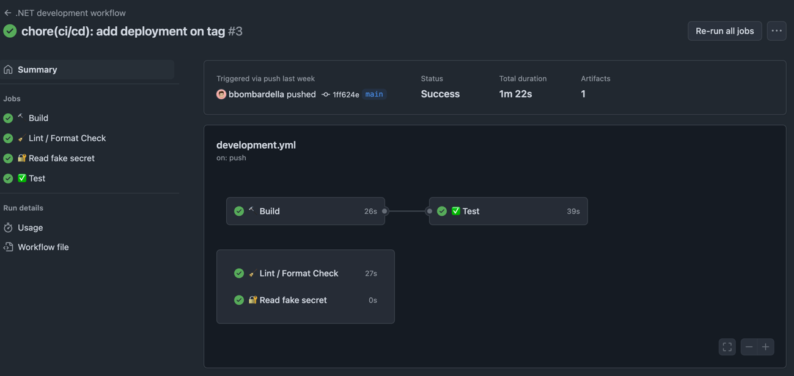
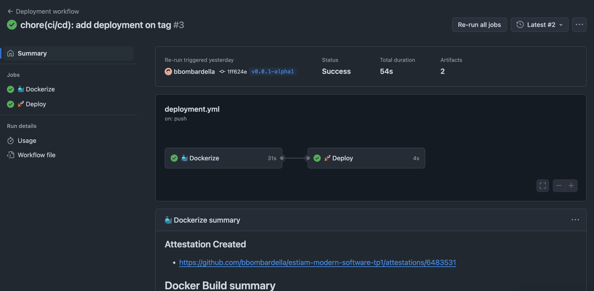
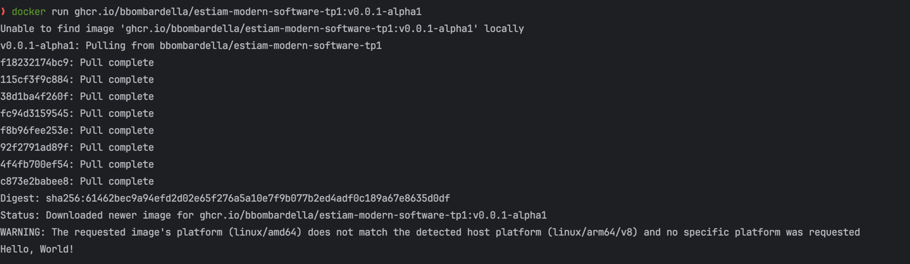

# Compte-rendu TP1

## Informations

TP1 réalisé par **Bastien BOMBARDELLA - E5 WMD** (bastien.bombardella@estiam.com)

*Lien du dépôt GitHub : https://github.com/bbombardella/estiam-modern-software-tp1*

## Les pipelines

### Workflow de développement

Pipeline déclenchée lors d'une pull request ou d'un push sur les branches
suivantes :

- `main`
- `develop`
- `release/**`

Ce workflow est composé de plusieurs jobs :

- Le build
- Les tests (job dépendant de build et partage d'artéfact)
- Le lint
- La lecture d'un secret configuré dans le dépôt GitHub

### Workflow de déploiement

Pipeline déclenchée lors de la création d'un tag `v*.*.*`

Ce workflow est composé de plusieurs jobs :

- La dockerisation (build de l'image Docker + déploiement dans le GitHub Container Registry)
- Le déploiement (exécution du script `deploy.sh`)

## Exécution du Docker

Voici une image montrant l'exécution de l'image Docker générée
par GitHub Actions et stockée dans le GitHub Container Registry

## Question du TP

> “Quel est le rôle du CI/CD et des tests dans un projet réel
> ?”

Le CI/CD automatise les tests et les déploiements pour garantir que chaque modification de code est fiable, testée et
prête à être livrée rapidement. Les tests assurent que le logiciel fonctionne comme prévu et évitent les régressions.
